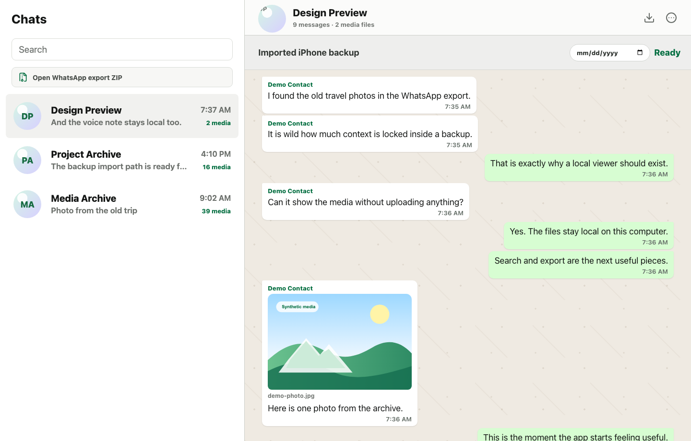

# WhatsVault

WhatsVault is a local-first desktop app for browsing WhatsApp chats and media from iPhone backups. It runs on your computer and does not upload your messages, backups, contacts, or media.

Status: pre-alpha desktop viewer. WhatsApp export ZIP viewing works as the first local source path. The desktop app can scan default iPhone backup folders, show local backup/WhatsApp status, and route a selected ready backup into the shared chat-list/import UI path. Real iPhone-backup browsing still needs proof against a real local backup before it can be marked supported.



Screenshot and video use synthetic demo data only.

[Watch the synthetic 18-second demo video](docs/assets/whatsvault-readme-demo.mp4)

## Goal

The intended product path is simple:

1. Open WhatsVault.
2. Pick a local iPhone Finder, iTunes, or Apple Devices backup.
3. Browse WhatsApp chats and media locally.
4. Search messages.
5. Export a selected chat to self-contained HTML.

No terminal workflow, manual backup-ID hunting, or copying SQLite files by hand should be required in the finished app.

## Privacy

WhatsVault is designed around local-only processing:

- No account.
- No cloud sync.
- No message upload.
- No hosted parsing service.
- No analytics on private chat content.

Real backups, exported chats, SQLite databases, media, and private fixtures must stay out of the repository. See `.gitignore` before adding any sample data.

See [SECURITY.md](SECURITY.md) for the security reporting policy.

## Current Direction

The selected app direction is Tauri v2 with React and TypeScript:

- Tauri keeps the app cross-platform for macOS and Windows while allowing a Rust core for local filesystem and SQLite work.
- React and TypeScript keep the interface portable, testable, and fast to iterate.
- Shared parser/model logic should sit behind stable internal APIs so the UI never depends directly on WhatsApp SQLite or export-file quirks.

The first supported source target remains iPhone local backups. A WhatsApp exported chat ZIP can be useful as a development source, but it must not replace the iPhone-backup roadmap.

The current desktop app uses the exported chat ZIP path first so the viewer, layout, search, media-preview, and HTML-export flow can be exercised without requiring a local iPhone backup.

## Roadmap

See [ROADMAP.md](ROADMAP.md).

## Architecture

See [docs/architecture.md](docs/architecture.md).

## Supported Sources

See [docs/supported-sources.md](docs/supported-sources.md) for the current source matrix.

## Demo Video

README demo videos must be generated from synthetic English demo data, not private chats or backups.

See [docs/demo-video.md](docs/demo-video.md) for the Playwright plus `playwright-recast` workflow that produces the committed synthetic MP4.

## Contributing

See [CONTRIBUTING.md](CONTRIBUTING.md), [docs/troubleshooting.md](docs/troubleshooting.md), and [docs/ci-release.md](docs/ci-release.md).

## Verified So Far

- Public-safe repository foundation is in place.
- Shared Rust core crate exists at `crates/whatsvault-core`.
- WhatsApp export ZIP import is tested with synthetic fixtures.
- A private ignored test hook validates a local export ZIP without printing chat content.
- A Tauri desktop app exists at `apps/desktop`.
- The desktop app can open a WhatsApp export ZIP through a native file picker, parse it in Rust, render the chat timeline, search messages, preview bounded images, stickers, audio, video, and documents from the archive, open image previews, and export the chat to self-contained HTML.
- The desktop app can scan default iPhone backup folders and show safe display metadata plus WhatsApp file-detection status without showing local backup paths in the UI.
- Default iPhone backup root construction is tested for macOS, Windows Microsoft Store Apple Devices or iTunes, and Windows legacy iTunes locations.
- iPhone backup discovery and `Manifest.db` mapping are tested with synthetic fixtures.
- Modern iPhone backup `fileID` values are resolved to physical backup files through the centralized core resolver.
- Synthetic `ChatStorage.sqlite` files can be summarized for message, chat, and media-item counts through the shared core crate.
- Synthetic `ChatStorage.sqlite` files can list chats by latest message and import one selected chat into the same normalized `ChatImport` model used by the desktop timeline.
- The Tauri command layer can resolve a selected backup's `ChatStorage.sqlite` through `Manifest.db` and call the core chat-list/import API.
- The React app can select a ready backup, show discovered chats in the sidebar and backup panel, and open one selected backup chat through the same normalized timeline used by export ZIP imports. This path is currently covered with synthetic data; real-backup proof is still pending.
- Backup media preview can resolve synthetic `ChatStorage.sqlite` media paths through `Manifest.db` to hashed backup files and return bounded browser-readable previews. Real-backup proof is still pending.
- Backup HTML export can re-import a selected synthetic backup chat by id, embed bounded media resolved through `Manifest.db`, and write through the shared escaped core exporter. Real-backup proof is still pending.
- The desktop source screen separates the available WhatsApp export ZIP viewer from iPhone-backup proof work.
- The desktop search field filters selected-chat messages and backup chat summaries through shared frontend domain helpers.
- The desktop timeline renders a bounded recent-message window with a tested "show earlier" path for synthetic 900-message chats.
- The public synthetic demo renders a safe inline image preview and image-preview modal without using private media files.
- The README links to a committed synthetic MP4 generated through the Playwright plus `playwright-recast` workflow.
- The desktop visual suite covers keyboard focus visibility, accessible names for icon-only controls, contrast floors for core text, and removal of fake or unsupported action chrome.
- A private-safe proof CLI exists at `crates/whatsvault-proof`.
- A macOS `.app` bundle and DMG can be built locally with Tauri, and release checksum manifests can be generated from the bundle outputs.
- Visible packaged-window smoke on this local macOS 26.5.1 machine is currently blocked by the upstream Tauri/Tao blank-window issue tracked at [tauri-apps/tauri#15517](https://github.com/tauri-apps/tauri/issues/15517). Do not treat browser visual checks as a substitute for packaged app smoke.
- CI and draft-release workflows are configured for macOS Apple Silicon, macOS Intel, and Windows Tauri builds.
- Release checksum manifests can be generated from Tauri bundle outputs and are uploaded by the draft-release workflow.
- The real local iPhone-backup proof remains separate from the export-ZIP viewer path.

## Development

Install desktop app dependencies:

```sh
cd apps/desktop
npm install
```

Run all Rust tests from the repository root:

```sh
cargo test --workspace
```

Run desktop frontend tests:

```sh
cd apps/desktop
npm test
```

Run desktop visual layout checks:

```sh
cd apps/desktop
npm run visual:check
```

Run Rust formatting and lint checks:

```sh
cargo fmt --all -- --check
cargo clippy --workspace --all-targets -- -D warnings
```

Record and render the synthetic README demo video:

```sh
cd apps/desktop
npm run demo:video
```

Run the desktop web preview:

```sh
cd apps/desktop
npm run dev
```

Run the Tauri desktop app:

```sh
cd apps/desktop
npm run tauri dev
```

Build the macOS app and DMG:

```sh
cd apps/desktop
npm run tauri build
```

Generate checksum manifests for the local Tauri bundle outputs:

```sh
cd apps/desktop
npm run release:checksums
```

Current HTML export behavior:

- Exports the loaded WhatsApp export ZIP chat to one `.html` file.
- Exports the selected iPhone backup chat to one `.html` file when the backup path and selected chat id are available. This path is covered by synthetic tests; real-backup proof is still pending.
- Escapes message text, sender names, filenames, and titles.
- Embeds media as data URLs when the attachment has a known browser media type and fits within the local per-file and total export size limits.
- Lists media that cannot be embedded instead of failing the export.

Run the private-safe backup proof command against default backup roots:

```sh
cargo run -p whatsvault-proof
```

Run the proof command against a specific backup root:

```sh
cargo run -p whatsvault-proof -- "/path/to/MobileSync/Backup"
```

The proof command reports aggregate counts and booleans only. It does not print device IDs, backup paths, file IDs, contacts, message bodies, or media filenames.

Optionally validate a private local WhatsApp export ZIP without printing chat content:

```sh
WHATSVAULT_PRIVATE_EXPORT_ZIP="/path/to/private-export.zip" \
  cargo test -p whatsvault-core --test whatsapp_export_zip -- \
  --ignored imports_private_export_zip_without_printing_chat_content
```

## Development Notes

The exported ZIP viewer is the first fully proven desktop path. The hard iPhone-backup gate remains locating and reading WhatsApp data from a real local iPhone backup through `Manifest.db`.

Real private exports and backups must stay in ignored local paths. Committed tests use synthetic fixtures or ignored private samples.
