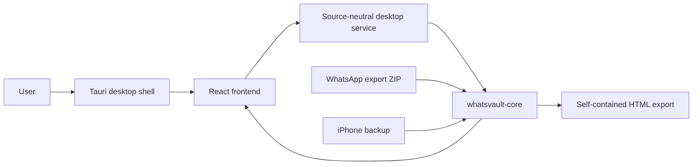

# WhatsVault Architecture

WhatsVault has one product goal: let a user browse WhatsApp chats and media from local iPhone backups without uploading private data or using a terminal.

## Source Types

The app should support source types through one internal interface so parsing paths do not drift.

### iPhone Backup Source

Primary roadmap source.

Expected local backup roots:

- macOS: `~/Library/Application Support/MobileSync/Backup/`
- Windows Microsoft Store Apple Devices or iTunes: `%USERPROFILE%\Apple\MobileSync\Backup\`
- Windows legacy iTunes: `%APPDATA%\Apple Computer\MobileSync\Backup\`

The root construction is centralized in `sources::iphone_backup` and covered by tests for both macOS and Windows so platform path support does not drift.

The iPhone backup source is responsible for:

1. Listing candidate backup folders.
2. Reading backup metadata from `Info.plist`, `Status.plist`, and `Manifest.plist` when present.
3. Opening `Manifest.db`.
4. Resolving logical iOS paths from `Files.domain` and `Files.relativePath`.
5. Mapping `fileID` values to hashed backup-file locations.
6. Locating WhatsApp databases and media files.
7. Returning stable app data through shared models.

### WhatsApp Export ZIP Source

First usable desktop source and optional-import source.

WhatsApp mobile exports commonly include one `_chat.txt` file and media files when media is attached. This source is useful for the first local viewer workflow and parser development, but it does not satisfy the core iPhone-backup proof gate.

The export ZIP source is responsible for:

1. Opening a ZIP without extracting it eagerly.
2. Finding exactly one chat transcript file.
3. Classifying media entries by extension and filename metadata.
4. Parsing transcript lines into normalized messages.
5. Resolving transcript media references to ZIP entries.
6. Reading bounded attachment payloads for media previews without extracting the whole archive.
7. Returning a bounded latest-message window for large transcripts instead of materializing every message for the UI.
8. Returning the same shared app models used by the iPhone backup source.

## Shared Model Boundary

All source-specific weirdness must stay behind importer modules. The UI should consume only shared models:

- `BackupSource`
- `Chat`
- `Message`
- `Contact`
- `Attachment`
- `ImportIssue`

Rules:

- Source-specific table names, ZIP filename formats, timestamp formats, and media paths must not leak into React components.
- Every parser should produce the same model shape.
- Any new source type must implement the same source interface instead of creating parallel UI paths.
- Tests should target parser behavior through stable APIs, not incidental implementation details.

## App Layers

```text
Desktop shell
  Tauri commands and permissions
  Local file picker
  Local filesystem and SQLite access

Domain core
  Source detection
  Importers
  Shared models
  Search and export services

Frontend
  WhatsApp-like app shell
  Backup/source picker
  Chat list
  Message timeline
  Media preview
  Search and export controls
```



## Desktop App

The first app shell lives in `apps/desktop`.

Stack:

- Tauri v2 desktop shell.
- React and TypeScript frontend.
- Rust commands that call `whatsvault-core`.
- Tauri dialog plugin for backend-owned native file open/save dialogs.

Current commands:

- `open_whatsapp_export`: opens the native ZIP picker in Rust, parses the selected ZIP through `sources::whatsapp_export_zip` into a bounded latest-message window, registers the real path behind an opaque source handle, and returns shared models plus safe display metadata.
- `read_export_attachment_preview`: reads a bounded media payload from a registered ZIP source handle and returns a browser-safe data URL for preview.
- `read_iphone_backup_attachment_preview`: resolves a WhatsApp media relative path through a registered backup handle and its `Manifest.db`, reads the bounded hashed backup file when present, and returns a browser-safe data URL for preview.
- `export_whatsapp_export_html`: opens the native save dialog in Rust, imports the registered ZIP source handle into a bounded latest-message window, embeds bounded media through shared core rules, builds HTML through `exports::html`, and writes the selected output file without returning the private output path to React.
- `export_iphone_backup_chat_html`: opens the native save dialog in Rust, resolves `ChatStorage.sqlite` through a registered backup handle and its `Manifest.db`, imports the selected chat by id, embeds bounded media through the backup media resolver, builds HTML through `exports::html`, and writes the selected output file without returning the private output path to React.
- `list_iphone_backups`: scans default local backup roots, reads safe display metadata from plist files when present, inspects `Manifest.db` for WhatsApp files, and returns backup status summaries for the empty-state panel.
- `choose_iphone_backup_folder`: opens a native folder picker when macOS denies automatic backup-root access, accepts either a MobileSync Backup folder or one device backup folder, and registers the result through the same opaque backup handles used by default scanning.
- `list_iphone_backup_chats`: resolves `ChatStorage.sqlite` from a selected backup through `Manifest.db` and returns normalized chat summaries.
- `search_iphone_backup_chats`: resolves `ChatStorage.sqlite` from a selected backup and searches backup chat names through a bounded backend query, so huge backup chat lists are not limited to the first visible sidebar window.
- `import_iphone_backup_chat`: resolves `ChatStorage.sqlite` from a selected backup and imports one selected chat into the normalized `ChatImport` timeline model.
- `search_iphone_backup_chat`: resolves `ChatStorage.sqlite` from a selected backup and searches one selected chat with a bounded latest-match result set, so huge histories stay responsive without exposing backup paths to React.

The frontend may derive presentation details such as filtered message windows and chat-row summaries, but it must not parse WhatsApp transcript syntax or ZIP structure.

Desktop command support modules keep shared Tauri boundary rules centralized:

- `apps/desktop/src-tauri/src/dtos.rs` owns serialized command payloads and camelCase DTO shape.
- `apps/desktop/src-tauri/src/source_registry.rs` owns opaque source handles for local backup and export paths.
- `apps/desktop/src-tauri/src/public_error.rs` owns redacted user-facing command errors.

Tauri path boundary rules:

- Native open/save dialogs live in Rust commands, not JavaScript.
- React receives opaque source handles and safe display names, not real backup paths, export paths, backup IDs, or file IDs.
- Command results must not echo private output paths. Success can report counts and status only.
- User-facing command errors should be classified and redacted by default.

Frontend source handling should stay source-neutral:

- `apps/desktop/src/domain/source.ts` owns source profiles such as labels, picker metadata, and safe display names.
- `apps/desktop/src/services/desktop.ts` exposes source-neutral operations such as opening a local chat source, reading a local attachment preview, exporting the loaded chat, and listing local iPhone backup candidates.
- React components receive a `LoadedChatSource` plus normalized `ChatImport` data. They should not call ZIP-specific or backup-specific commands directly.
- The iPhone backup UI can show readable backup labels, encryption state when known, WhatsApp file-detection status, discovered chats for a selected ready backup, bounded backend search across backup chat names, selected backup chats in the shared timeline, bounded backend search for the selected chat, bounded media previews, and bounded HTML export. Real local backup smoke has verified chat rendering, media preview, and export without committing private artifacts.
- The conversation timeline renders only a bounded recent message window by default, exposes an explicit "show earlier" action for older messages, and virtualizes the rendered DOM rows for that loaded window. This keeps large chats usable without requiring the UI to parse source-specific data or mount every loaded message at once.
- Future iPhone backup work should extend the source profile and desktop service boundary instead of creating a parallel React flow.

Media rendering rules:

- The core crate detects attachment media types in `media`.
- The desktop command returns a data URL only when the attachment fits the preview size cap and has a known media type.
- The React UI chooses a presentation kind from the returned media type: image/sticker preview, audio player, video player, document link, or file placeholder.
- Image previews can open in an in-app modal; oversized or unsupported media remains visible as a labeled placeholder instead of failing the chat view.

## Core Crate

Shared import and model logic lives in `crates/whatsvault-core`.

Current modules:

- `model`: source-neutral data structures returned to the app.
- `exports::html`: self-contained chat HTML generation with HTML escaping and embedded attachment support.
- `media`: shared attachment media-type detection used by preview and export paths.
- `sources::iphone_backup`: backup-root discovery, `Manifest.db` mapping, and fileID-to-physical-file resolution.
- `sources::whatsapp_export_zip`: WhatsApp mobile export ZIP parsing, latest-message windowing for large transcripts, media classification, reference resolution, and bounded attachment payload lookup.
- `whatsapp::chat_storage`: read-only `ChatStorage.sqlite` summary, chat-listing, chat-list search, selected-chat import, and selected-chat search logic. It adapts to missing optional columns and returns source-neutral `Chat` and `ChatImport` models. Chat-list summaries and chat-list search use bounded result sets and set-based aggregate queries, while selected-chat search returns bounded latest matches, so large backups do not require repeated unbounded scans or UI-sized message loads.
- `whatsapp::chat_storage_display`: private helper boundary for display-safe chat titles, message text, sender names, and media filenames derived from `ChatStorage.sqlite` rows. This keeps privacy-preserving normalization centralized instead of spreading identifier-redaction rules through query code.

The Tauri shell should call this core crate instead of reimplementing parser rules in frontend code.

## HTML Export

HTML export is owned by `crates/whatsvault-core/src/exports/html.rs`.

Rules:

- The exporter receives shared `ChatImport` data and a list of already-approved embedded attachments.
- Text, sender names, titles, timestamps, filenames, and data URLs are escaped before rendering.
- Media type detection lives in `crates/whatsvault-core/src/media.rs`.
- The desktop app controls local file selection plus per-file and total embedded-media size limits, but it does not generate HTML itself.
- Attachments that are missing, too large, or unsupported are listed in the HTML rather than making export fail.

## Proof CLI

`crates/whatsvault-proof` is a small command-line proof runner for the pre-UI phase.

It checks configured backup roots, finds candidate backups, inspects `Manifest.db`, resolves `ChatStorage.sqlite` through the backup fileID mapping, reads aggregate WhatsApp database counts, lists a bounded chat sample, and imports a bounded first-chat sample into the normalized app model when the physical SQLite file is readable. It intentionally reports only aggregate counts, sampled counts, sample limits, and booleans so the command is safe to paste into issues or development notes.

Run it with default backup roots:

```sh
cargo run -p whatsvault-proof
```

Run it with an explicit MobileSync backup root:

```sh
cargo run -p whatsvault-proof -- "/path/to/MobileSync/Backup"
```

## UI Direction

The UI should follow the supplied WhatsApp desktop references:

- narrow left navigation rail
- chat list with search and dense rows
- selected chat header
- pale patterned conversation canvas
- left/right message bubbles
- restrained green accent
- quiet utility controls

The implementation should recreate the product skeleton, not ship screenshots as UI. Reusable design tokens and components should own the visual system so future screens do not drift.

## Privacy Boundary

Private data stays local:

- Do not commit real backups, exported chat ZIPs, SQLite databases, plist files, media, generated screenshots from private chats, or raw proof dumps.
- Do not log message bodies, contact identifiers, backup paths, or media filenames in committed examples.
- Keep any local manual samples inside ignored directories.

Committed fixtures must be synthetic and intentionally small.

## Current Proof Status

Synthetic tests now cover iPhone backup discovery, selected-folder fallback discovery, default backup-root construction for macOS and Windows, metadata plist parsing, `Manifest.db` mapping, fileID physical resolution, aggregate `ChatStorage.sqlite` counts, bounded proof CLI sampling, chat listing, selected-chat import into the normalized app model, the desktop command boundary from backup folder to resolved `ChatStorage.sqlite`, backup media preview/export resolution from `Manifest.db` to hashed backup files, bounded internal selected backup-chat HTML export through the shared exporter, and the React path that shows and opens backup chats through the shared timeline model. A real local MobileSync backup has now proven `Manifest.db` discovery, physical `ChatStorage.sqlite` resolution, aggregate counts, safe bounded chat-list extraction, normalized bounded chat import through the proof CLI, desktop chat rendering, bounded media preview, and bounded HTML export from the packaged app.

The next safe proof slice is:

1. Configure signed and notarized macOS release output.
2. Configure Windows code signing and run live Windows package proof.
3. Run the centralized signing readiness checker without printing secret values.
4. Record only sanitized aggregate evidence; do not commit screenshots or exports from private chats.
